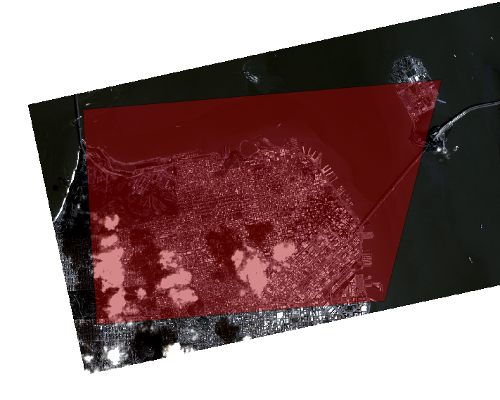

---
jupyter:
  jupytext:
    formats: ipynb,Rmd
    text_representation:
      extension: .Rmd
      format_name: rmarkdown
      format_version: '1.2'
      jupytext_version: 1.11.3
  kernelspec:
    display_name: Python 3
    language: python
    name: python3
---

# Clip a satellite image to AOI and reproject into a new CRS


```{python}
import rasterio
from matplotlib import pyplot as plt

# This notebook explores a single 4 band (blue, green, red, NIR) PlanetScope scene in a UTM projection.
image_file = "20190321_174348_0f1a_3B_AnalyticMS.tif"

# Use Rasterio to open the image.
satdat = rasterio.open(image_file)
```

```{python}
# rasterio.plot.show is a shortcut to matplotlib plotting

# from rasterio.plot import show
# show(satdat.read(), transform=satdat.transform)
plt.imshow(satdat.read(1))
plt.show(satdat)
```

## Using a mask to cut raster along boundary

In this exercise we're going to clip a fullsized PlanetScope dataset to an area of interest (AOI) polygon. Because this AOI is a vector dataset (versus raster), we'll use Rasterio's sister-library, Fiona, to read the geoJSON dataset:

```{python}
# fiona is another wrapper for GDAL for vector data
import fiona

# use fiona to open our AOI GeoJSON
with fiona.open('aoi.geojson') as f:
    aoi = [feature["geometry"] for feature in f]
```


_Area of Interest (shown here in red) displayed over a portion of the complete dataset_


In order to clip our original raster to the boundary defined by the AOI, we'll use rasterio's `mask` function. This will create a copy of our original dataset, with all pixels outside of the input AOI shape set to `nodata` values.

```{python}
# import rasterio's mask tool
from rasterio.mask import mask

# apply mask with crop=True to crop the resulting raster to the AOI's bounding box
with rasterio.open(image_file) as img:
    clipped, transform = mask(img, aoi, crop=True)
    
print(clipped.shape)
```

Using a copy of the metadata from our original raster dataset, we can write a new geoTIFF containing the new, clipped raster data:

```{python}
# use the metadata from our original mosaic
meta = img.meta.copy()

# update metadata with new, clipped mosaic's boundaries
meta.update({"transform": transform,
    "height":clipped.shape[1],
    "width":clipped.shape[2]})

# write the clipped-and-cropped dataset to a new GeoTIFF
with rasterio.open('clipped.tif', 'w', **meta) as dst:
    dst.write(clipped)
```

```{python}
clipped_img = rasterio.open("clipped.tif")
show(clipped_img)
```

## Reprojecting with rasterio

Now let's reproject our clipped dataset: for this example, we'll reproject into EPSG 4326

```{python}
from rasterio.warp import calculate_default_transform, reproject

# define our target CRS - rasterio will accept any CRS that can be defined using WKT
target_crs = 'EPSG:4326'
```

### Transforms

In order to translate pixel coordinates in a raster dataset into coordinates that use a spatial reference system, an **affine transformation** must be applied to the dataset. This **transform** is a matrix used to translate rows and columns of pixels into (x,y) spatial coordinate pairs. Every spatially referenced raster dataset has an affine transform that describes its pixel-to-map-coordinate transformation.

In order to reproject a raster dataset from one coordinate reference system to another, rasterio uses the **transform** of the dataset: this can be calculated automatically using rasterio's `calculate_default_transform` method:

```{python}
# calculate a transform and new dimensions using our dataset's current CRS and dimensions
transform, width, height = calculate_default_transform(clipped_img.crs, 
                                                      target_crs, 
                                                       clipped_img.width, 
                                                       clipped_img.height, 
                                                       *clipped_img.bounds)
```

Using a copy of the metadata from the clipped raster dataset and the transform we defined above, we can write a new geoTIFF containing the reprojected and clipped raster data:

```{python}
# Copy the metadata from the clipped dataset
metadata = clipped_img.meta.copy()

# Change the CRS, transform, and dimensions in metadata to match our desired output dataset
metadata.update({'crs':target_crs, 
                'transform':transform,
                'width':width,
                'height':height})
```

```{python}
# apply the transform & metadata to perform the reprojection
# here we're saving the output to a new 'clipped_4326.tif' file
with rasterio.open('clipped_4326.tif', 'w', **metadata) as reprojected:
    for band in range(1, clipped_img.count + 1):
        reproject(
            source=rasterio.band(clipped_img, band),
            destination=rasterio.band(reprojected, band),
            src_transform=clipped_img.transform,
            src_crs=clipped_img.crs,
            dst_transform=transform,
            dst_crs=target_crs
        )
```

```{python}
# take a look at our clipped & reprojected dataset
reproj = rasterio.open("clipped_4326.tif")
show(reproj)
```

```{python}

```
