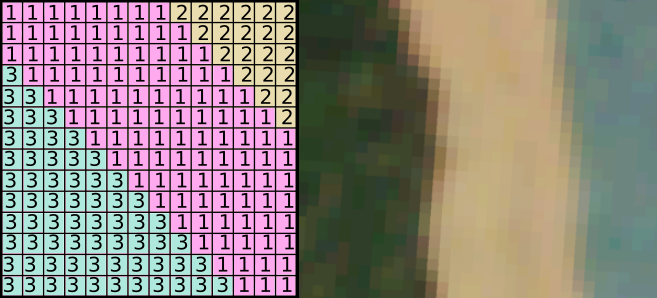

---
jupyter:
  jupytext:
    formats: ipynb,Rmd
    text_representation:
      extension: .Rmd
      format_name: rmarkdown
      format_version: '1.2'
      jupytext_version: 1.11.3
  kernelspec:
    display_name: Python 3
    language: python
    name: python3
---

# Demonstrate the relationship between Rasterio datasets and NumPy n-dimensional arrays


## Load dataset

```{python}
# user rasterio to open our dataset

import rasterio
satdat = rasterio.open("20190321_174348_0f1a_3B_AnalyticMS.tif")
```

## Parse bands

```{python}
blue, green, red, nir = satdat.read()
```

## Pixels grids as numpy arrays

In a raster dataset, each pixel has a value. Pixels are arranged in a grid, and pixels representing equivalent data have the same value:



```{python}
# Bands are stored as Numpy arrays.

print(type(blue))
```

```{python}
# How many dimensions would a single raster band have?  Two dimensions: rows and columns.

print(blue.ndim)
```

```{python}
# Take a look at the datatype of the values in this band.

print(blue.dtype)
```

```{python}
# Output a min & max pixel value in each band.

for band in [blue, green, red, nir]:
    print("min {min} max {max}".format(min=band.min(), max=band.max()))
```

```{python}
import math

# Let's grab the pixel 10km east and 10km south of the upper left corner

# World coordinates for the desired pixel.
x_coord = satdat.bounds.left + 10000
y_coord = satdat.bounds.top - 10000

# Convert world coordinates to pixel.  World coordinates may not transform precisely to row and column indexes,
# but a Numpy array can only be indexed by integer values.  The 'op' parameter for 'satdat.index()' determines
# how the transformed values are rounded.  In some cases any point falling within a pixel should be considered
# contained, and in other cases only points falling within one portion of the pixels hould be considered contained.
# The 'op' parameter lets users make this decision on their own.  The values must still be cast to integers.
col, row = satdat.index(x_coord, y_coord, op=math.floor)
col = int(col)
row = int(row)


# Now let's look at the value of each band at this pixel
print("Red: {}".format(red[row, col]))
print("Green: {}".format(green[row, col]))
print("Blue: {}".format(blue[row, col]))
print("NIR: {}".format(nir[row, col]))
```
